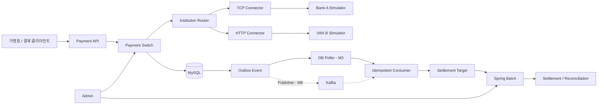

# PaySwitch

> 금융기관 연동, 원화·외화 승인, 취소, 정산 및 대사를 학습하기 위한 PG(Payment Gateway) 결제 스위치

**상태:** 설계 중  
**현재 목표:** 독립된 TCP 기관 simulator와 통신하며 중복과 결과 불확실성에 안전한 원화 승인 MVP 구현

## 프로젝트 소개

PaySwitch는 외부 PG API를 사용하는 커머스 결제 서버가 아니라, 여러 금융기관 및 VAN과 통신하는 **PG 내부 결제 스위치**를 구현하는 학습 프로젝트다.

기관마다 다른 통신 방식과 전문 규격을 내부 표준 거래 모델로 변환하고, 승인 결과를 확정할 수 없는 네트워크 장애와 중복 요청을 안전하게 처리한다. 승인 이후에는 이벤트와 배치를 통해 정산, 대사 및 운영 업무를 수행한다.

실제 금융기관이나 실결제망에는 연결하지 않는다. 전문 규격과 거래 데이터는 모두 학습용으로 정의하며 실제 카드·계좌·개인정보를 사용하지 않는다.

## MVP

첫 번째 실행 가능한 버전의 범위는 다음과 같다.

- KRW 승인·조회
- TCP 고정 길이 전문 송수신
- Bank A simulator의 정상·거절·timeout·응답 유실 모드
- 승인 결과가 불확실할 때 `202 Accepted`와 `UNKNOWN` 반환
- 동일 멱등키 재요청 처리 및 요청 내용 충돌 거절
- 조회 전문을 이용한 `UNKNOWN` 거래 복구
- correlation ID를 포함한 구조화 로그

취소·망취소, 외화, 정산·대사, 관리자 페이지 및 Kafka는 MVP 이후 단계적으로 추가한다.

## 핵심 설계 원칙

### 온라인 거래는 동기, 후속 처리는 비동기

승인·취소는 호출자가 가능한 즉시 확정 결과를 받을 수 있도록 기관 응답까지 동기식으로 처리한다. 정산 대상 생성, 통계, 알림과 운영 이벤트는 온라인 응답 경로에서 분리한다.

### 불확실한 결과는 실패로 단정하지 않는다

기관은 승인했지만 PG가 응답을 받지 못할 수 있다. 이 경우 `UNKNOWN` 거래를 만들고 같은 승인을 다시 보내지 않는다. 조회 전문, 망취소 및 대사로 최종 상태를 확정하며 해결할 수 없는 거래는 수동 확인 대상으로 전환한다.

### 결제와 개별 금융거래를 분리한다

- `Payment`: 승인 금액, 취소 누적 금액 등 결제 전체의 현재 상태
- `FinancialTransaction`: 승인·취소·망취소 각각의 독립된 상태와 멱등성
- `InstitutionMessageAttempt`: 기관에 전문을 송수신한 개별 시도와 결과

따라서 원결제는 승인 상태이면서 동시에 부분 취소 거래는 `UNKNOWN`일 수 있다.

### DB가 최종 정합성을 보장한다

Redis나 분산 락만으로 거래를 보호하지 않는다. MySQL 유일 제약, 요청 hash, 조건부 갱신, 낙관적 락 및 상태 전이 규칙으로 중복과 금액 정합성을 보장한다.

### 기관 장애를 격리한다

기관마다 별도의 connection pool, 동시 요청 제한, timeout과 circuit 상태를 둔다. 한 기관의 지연이나 장애가 다른 기관의 요청 처리 자원을 소진하지 않게 한다.

### Simulator는 결제 스위치와 독립적으로 구현한다

Simulator는 별도 Gradle 모듈과 프로세스로 실행한다. 결제 스위치의 codec을 의존하지 않고 공개된 전문 명세와 수작업 검증 fixture만 공유하여 동일 codec 버그가 양쪽에서 상쇄되지 않게 한다.

## 시스템 구성

초기에는 모듈러 모놀리스로 구현한다. Outbox는 먼저 DB poller로 처리하고, 이벤트 계약이 안정된 후 transport를 Kafka로 확장한다.

## 예정 기술 스택

| 영역 | 기술 | 용도 |
|---|---|---|
| Language | Kotlin | 결제 코어, 기관 connector, 배치 및 관리자 개발 |
| Application | Spring Boot | 애플리케이션과 모듈 구성 |
| Persistence | MyBatis, MySQL | 명시적인 SQL, 트랜잭션 및 쿼리 튜닝 |
| Network | Netty | TCP framing, multiplexing, timeout 및 connection 관리 |
| Batch | Spring Batch | 재시작 가능한 마감·정산·대사 job |
| Scheduler | Quartz | 영업일과 기관별 실행 일정 관리 |
| Event | Transactional Outbox, Kafka | 유실과 중복에 안전한 후속 처리 |
| Cache | Redis | 라우팅·환율 캐시와 rate limit 보조 |
| Admin | Spring MVC, Thymeleaf | 운영 중심의 server-side 관리자 화면 |
| Observability | JSON Log, Micrometer, ELK | 거래 추적, 지표 및 로그 검색 |
| Test | JUnit 5, AssertJ, Testcontainers, WireMock | 도메인·통합·장애 테스트 |

Kafka, Redis와 ELK 전체 구성은 기본 실행에 포함하지 않는다. 해당 문제를 다루는 milestone에서 선택적 Docker Compose profile로 제공한다.

## 개발 로드맵

### Milestone 0 — 설계 기준선

- [x] 프로젝트 목표와 범위 정의
- [x] 거래 모델과 `UNKNOWN` 응답 정책 결정
- [x] 가상 TCP 전문 v1 정의
- [ ] Gradle 멀티모듈 구성

### Milestone 1 — 거래 코어

- [ ] 승인 도메인과 상태 전이
- [ ] MyBatis 기반 거래 저장소
- [ ] 멱등키와 요청 hash 검증
- [ ] correlation ID와 구조화 로그
- [ ] 조건부 갱신과 동시성 테스트

### Milestone 2 — 원화 승인 MVP와 독립 TCP 기관 연동

- [ ] Bank A codec과 Netty client
- [ ] 독립 Bank A simulator
- [ ] multiplexing과 요청·응답 correlation
- [ ] 기관별 connection pool과 bulkhead
- [ ] timeout, 지연 응답 및 응답 유실 테스트

### Milestone 3 — 불확실성·취소·이벤트

- [ ] 조회를 통한 `UNKNOWN` 거래 복구
- [ ] 독립된 취소·망취소 거래와 멱등성
- [ ] 늦은 응답과 상충 결과 처리
- [ ] VAN B HTTP simulator, connector와 기관 라우팅
- [ ] Transactional Outbox와 DB poller
- [ ] 멱등 consumer와 inbox

### Milestone 4 — 외화·정산·대사 배치

- [ ] KRW·USD 금액과 환율 snapshot
- [ ] 정산 대상 생성과 일 마감
- [ ] Spring Batch 정산·대사 job
- [ ] 부분 취소 반올림 잔액 처리
- [ ] 재실행·skip·retry·대량 SQL 테스트

### Milestone 5 — 운영 기능

- [ ] 거래·전문·상태 변경 이력 조회
- [ ] 기관, 응답 코드와 라우팅 설정
- [ ] 배치 실행과 대사 불일치 관리
- [ ] 운영자 감사 로그
- [ ] Micrometer 지표와 선택적 ELK profile

### Milestone 6 — Kafka 확장

- [ ] Outbox 이벤트 Kafka 발행
- [ ] 정산·통계 consumer 분리
- [ ] retry와 dead-letter 처리
- [ ] 중복 이벤트 및 offset commit 장애 테스트

## 상세 문서

- [용어집](docs/glossary.md)
- [도메인 모델과 상태 정책](docs/domain-model.md)
- [Bank A TCP 전문 v1](docs/protocol-bank-a.md)
- [데이터 모델](docs/database-schema.md)
- [이벤트 계약과 전달 정책](docs/events.md)
- [배치·외화·정산·대사](docs/batch-and-settlement.md)
- [장애 시나리오](docs/failure-scenarios.md)
- [ADR 목록](docs/adr/README.md)
