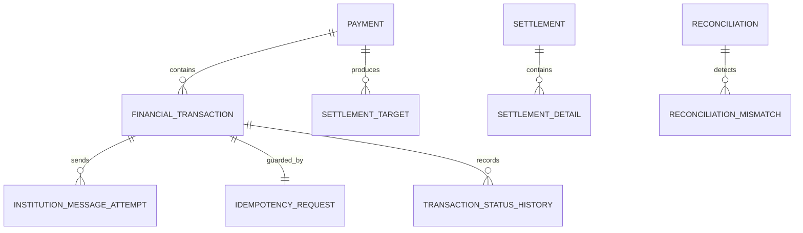

# 데이터 모델

[문서 홈](README.md) · [프로젝트 홈](../README.md)

이 문서는 구현 전 논리 모델이다. 실제 DDL과 인덱스는 Milestone 1에서 migration으로 관리한다.

## 관계



## 핵심 테이블

### payment

가맹점 주문 단위의 결제 요약과 취소 가능 금액을 관리한다.

```text
payment_id
merchant_id
client_reference
approved_amount_minor
cancelled_amount_minor
reserved_cancel_amount_minor
transaction_currency
status
version
created_at
updated_at
```

`approved_amount_minor`, `cancelled_amount_minor`, `reserved_cancel_amount_minor`는 거래 통화의 최소 단위 정수로 저장한다. 갱신 시 다음 조건을 DB에서도 검증한다.

```text
cancelled_amount_minor >= 0
reserved_cancel_amount_minor >= 0
cancelled_amount_minor + reserved_cancel_amount_minor <= approved_amount_minor
```

### financial_transaction

승인·취소·망취소 각각의 독립된 금융거래다.

```text
transaction_id
payment_id
transaction_type
original_transaction_id
amount_minor
currency
status
institution_id
institution_approval_number
institution_response_code
failure_stage
version
created_at
resolved_at
```

`original_transaction_id`는 취소와 망취소에서 원승인 또는 보상 대상 거래를 가리킨다.

### idempotency_request

```text
merchant_id
operation_type
idempotency_key
request_hash
transaction_id
created_at
expires_at
```

처리 규칙은 다음과 같다.

- 키가 없으면 새 금융거래를 만들고 같은 트랜잭션에서 idempotency row를 저장한다.
- 같은 키와 같은 `request_hash`면 기관을 다시 호출하지 않고 기존 거래의 현재 상태를 반환한다.
- 같은 키와 다른 `request_hash`면 `409 IDEMPOTENCY_KEY_REUSED`를 반환한다.
- 다른 멱등키로 같은 `client_reference`의 승인 내용이 달라지면 `409 CLIENT_REFERENCE_CONFLICT`를 반환한다.

### institution_message_attempt

```text
attempt_id
transaction_id
institution_id
business_date
trace_number
message_type
attempt_number
status
masked_request
masked_response
sent_at
received_at
failure_reason
```

요청과 응답은 한 attempt row에서 관리하므로 동일 trace number의 양방향 전문이 유일 제약과 충돌하지 않는다. raw 민감정보는 저장하지 않는다.

### transaction_status_history

append-only 상태 변경 이력이다.

```text
history_id
transaction_id
from_status
to_status
reason
correlation_id
changed_at
```

### outbox_event / consumer_inbox

```text
outbox_event
- event_id
- aggregate_type
- aggregate_id
- event_type
- event_version
- payload
- occurred_at
- published_at
- attempts

consumer_inbox
- consumer_name
- event_id
- processed_at
```

consumer의 업무 반영과 inbox 저장은 같은 DB 트랜잭션에서 처리한다.

## 정산·대사 테이블

```text
settlement_target
settlement
settlement_detail
reconciliation
reconciliation_mismatch
batch_operator_request
operator_audit_log
```

`settlement_target`은 Outbox consumer가 승인·취소 이벤트를 멱등하게 반영한 정산 입력 snapshot이다. Spring Batch가 온라인 거래 테이블을 실행 중 계속 조회하지 않도록 정산 기준 시점에 대상을 고정한다.

## 유일 제약

```text
payment:
  UNIQUE (merchant_id, client_reference)

idempotency_request:
  UNIQUE (merchant_id, operation_type, idempotency_key)

institution_message_attempt:
  UNIQUE (institution_id, business_date, trace_number)
  UNIQUE (transaction_id, attempt_number)

consumer_inbox:
  UNIQUE (consumer_name, event_id)

settlement:
  UNIQUE (merchant_id, settlement_business_date, settlement_currency)

settlement_target:
  UNIQUE (financial_transaction_id)
```

가상 Bank A에서는 trace number를 기관·영업일 단위로 유일하게 발급한다. 다른 기관을 추가할 때는 해당 전문 계약의 terminal ID, channel ID 또는 전송 일시를 포함하도록 유일성 규칙을 별도로 정의한다.

## 주요 조회 인덱스 후보

```text
payment (merchant_id, created_at, payment_id)
financial_transaction (payment_id, created_at)
financial_transaction (institution_id, status, created_at)
institution_message_attempt (institution_id, business_date, trace_number)
settlement_target (settlement_business_date, status, target_id)
reconciliation_mismatch (reconciliation_id, mismatch_type, status)
outbox_event (published_at, occurred_at)
```

인덱스는 예상만으로 확정하지 않는다. 대량 fixture와 실제 조회 SQL의 `EXPLAIN ANALYZE` 결과를 문서화한 뒤 조정한다.
