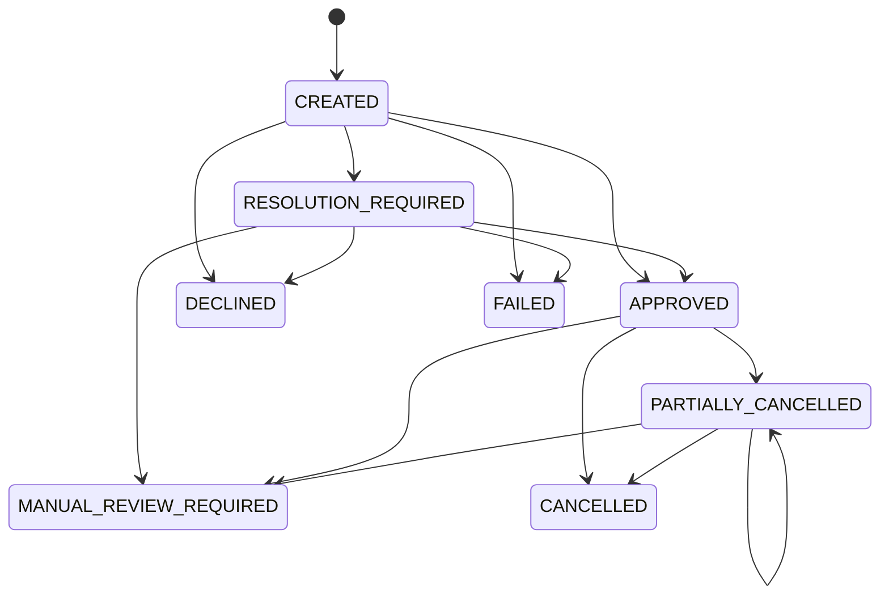
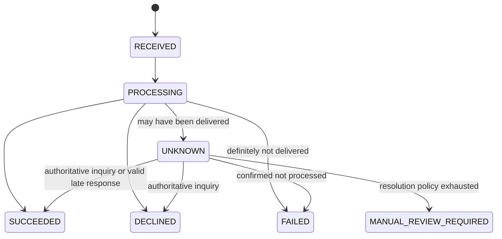

# 도메인 모델과 상태 정책

[문서 홈](README.md) · [프로젝트 홈](../README.md)

## 모델 경계

하나의 상태 값으로 결제 전체와 모든 금융거래를 표현하지 않는다.

```text
Payment
├── Authorization FinancialTransaction
├── Cancellation FinancialTransaction 0..N
├── Reversal FinancialTransaction 0..N
└── InstitutionMessageAttempt 1..N per transaction
```

### Payment

가맹점 주문에 대응하는 결제 전체의 현재 상태와 금액 합계를 관리한다.

```text
paymentId
merchantId
clientReference
approvedAmount
cancelledAmount
reservedCancelAmount
transactionCurrency
status
version
```

주요 불변식은 다음과 같다.

- `cancelledAmount + reservedCancelAmount`는 `approvedAmount`를 초과할 수 없다.
- 승인되지 않은 결제는 취소할 수 없다.
- 전액 취소된 결제는 추가 취소할 수 없다.
- `clientReference`는 가맹점의 최초 승인 요청 단위로 유일하다.



`Payment.status`는 요약 상태다. 승인이나 취소의 자세한 진행 상황은 `FinancialTransaction.status`에서 확인한다.

### FinancialTransaction

기관에 전달되는 승인, 취소 및 망취소를 각각 독립된 거래로 관리한다.

```text
transactionId
paymentId
type: AUTHORIZE | CANCEL | REVERSAL
originalTransactionId
idempotencyKey
requestHash
amount: Money(amountMinor, currency)
status
```



`FAILED`와 `DECLINED`는 다르다.

- `DECLINED`: 기관이 전문을 정상적으로 처리하고 업무상 거절했다.
- `FAILED`: routing 실패, 기관 점검 또는 연결 전 실패처럼 기관이 거래를 처리하지 않았음을 확정할 수 있다.
- `UNKNOWN`: bytes 전송 이후 timeout처럼 기관 처리 여부를 확정할 수 없다.

### InstitutionMessageAttempt

하나의 금융거래에 대한 실제 송수신 시도를 기록한다. 금융거래를 자동 재전송하지 않더라도 상태 조회 과정에서 여러 attempt가 생길 수 있다.

```text
attemptId
transactionId
institutionId
businessDate
traceNumber
messageType
attemptNumber
status
sentAt
receivedAt
failureReason
```

상태는 `CREATED`, `SENT`, `RESPONSE_RECEIVED`, `TIMED_OUT`, `CONNECTION_FAILED`, `MALFORMED_RESPONSE`를 사용한다.

## 구현된 승인 도메인 규칙

[`payment-domain`](../payment-domain/README.md)은 현재 KRW 승인에 필요한 `Payment`와 `AUTHORIZE` `FinancialTransaction`만 구현한다. 취소·망취소 거래, 금액 예약, 멱등키·요청 hash와 `InstitutionMessageAttempt`는 후속 Issue에서 추가한다.

### 금액과 식별자

- `Money`는 `amountMinor`(통화 최소 단위 정수)와 `currency`를 항상 함께 보유하며 음수를 거절한다. 0과 `Long.MAX_VALUE`는 보유할 수 있다.
- `paymentId`, `merchantId`, `clientReference`, `transactionId`는 blank 값을 거절하고 생성 후 변경할 수 없다.
- 승인 거래 생성과 `Payment` 승인 반영은 `KRW`이면서 1원 이상인 금액만 허용한다.

### 초기값

| 모델 | 초기 상태 | 초기값 |
|---|---|---|
| `Payment` | `CREATED` | `transactionCurrency=KRW`, `approvedAmount`·`cancelledAmount`·`reservedCancelAmount`=KRW 0, `version=0` |
| 승인 `FinancialTransaction` | `RECEIVED` | `type=AUTHORIZE`, `originalTransactionId=null`, `version=0` |

`approvedAmount`는 승인 전 KRW 0이며, `Payment`가 `APPROVED`로 전이할 때만 전달받은 승인 금액으로 설정된다.

### 구현된 전이

- `Payment`: `CREATED -> APPROVED | DECLINED | FAILED | RESOLUTION_REQUIRED`, `RESOLUTION_REQUIRED -> APPROVED | DECLINED | FAILED | MANUAL_REVIEW_REQUIRED`만 허용한다. 취소 관련 전이는 아직 구현하지 않았으므로 그 밖의 상태에서 나가는 전이는 모두 거절한다.
- `FinancialTransaction`: `RECEIVED -> PROCESSING`, `PROCESSING -> SUCCEEDED | DECLINED | FAILED | UNKNOWN`, `UNKNOWN -> SUCCEEDED | DECLINED | FAILED | MANUAL_REVIEW_REQUIRED`만 허용한다.
- `Payment.status=RESOLUTION_REQUIRED`는 승인 거래 `UNKNOWN`의 요약 표현이지만 별도 enum 값이다. 한 모델의 상태 변경 method는 다른 모델을 변경하지 않으며, 두 모델의 상태 동기화는 application 계층이 담당한다.

### version과 중복 적용

- 상태가 실제로 바뀔 때마다 `version`이 정확히 1 증가한다. 승인 반영처럼 상태와 금액이 함께 바뀌어도 1만 증가한다.
- 현재 상태와 같은 target 상태를 다시 적용하면 no-op이며 `version`을 증가시키지 않는다.
- 이미 `APPROVED`인 `Payment`에 같은 승인 금액을 다시 적용하면 no-op이고, 다른 금액은 상충 결과로 거절한다.
- terminal 상태에서 다른 결과를 적용하거나 허용되지 않은 전이를 요청하면 예외를 발생시키고 기존 상태·금액·`version`을 유지한다.

## API 결과 정책

| 상황 | HTTP | 거래 상태 | 정책 |
|---|---:|---|---|
| 요청 형식 오류 | 400 | 생성하지 않음 | 필드 오류를 반환한다. |
| 동일 멱등키·동일 요청 | 이전과 동일 | 기존 상태 | 새 기관 요청 없이 기존 응답을 반환한다. |
| 동일 멱등키·다른 요청 | 409 | 기존 상태 유지 | `IDEMPOTENCY_KEY_REUSED`를 반환한다. |
| 기관의 확정 승인 | 200 | `SUCCEEDED` | 승인번호와 결과를 반환한다. |
| 기관의 확정 거절 | 200 | `DECLINED` | 기관 응답 코드를 내부 코드로 변환한다. |
| 기관 전달 전 확정 실패 | 503 | `FAILED` | route/점검/연결 실패 사유를 반환한다. |
| 처리 여부 불확실 | 202 | `UNKNOWN` | 거래 ID, 조회 URL과 재조회 권고 시간을 반환한다. |

`UNKNOWN` 응답 예시는 다음과 같다.

```http
HTTP/1.1 202 Accepted
Location: /v1/payments/P202609130001
Retry-After: 3
```

```json
{
  "paymentId": "P202609130001",
  "transactionId": "T202609130001",
  "status": "UNKNOWN",
  "message": "기관 처리 결과를 확인 중입니다."
}
```

## UNKNOWN 해결 정책

1. `UNKNOWN`이 된 승인·취소·망취소 전문을 자동으로 다시 보내지 않는다.
2. 기관별 설정에 따라 조회 전문을 제한된 횟수와 시간 안에서 재시도한다.
3. 조회 결과 `NOT_FOUND`는 곧바로 거절로 확정하지 않고 resolution window 동안 `UNKNOWN`을 유지한다.
4. 최종 조회 결과가 권위 있는 결과라면 해당 금융거래를 확정한다.
5. 기관 계약이 허용하면 별도의 `REVERSAL` 거래를 생성한다.
6. 망취소도 결과가 불확실하거나 해결 한도를 초과하면 결제를 `MANUAL_REVIEW_REQUIRED`로 전환한다.

조회 횟수, 간격, resolution window 및 망취소 지원 여부는 기관별 정책으로 관리한다.

## 늦은 응답 정책

- 아직 `UNKNOWN`이고 보상 거래가 시작되지 않았다면 MAC, trace number와 원요청 내용을 검증한 뒤 확정 결과로 반영할 수 있다.
- 동일한 확정 결과가 다시 도착하면 중복 응답으로 기록하고 상태를 변경하지 않는다.
- 이미 망취소가 시작됐거나 늦은 응답이 현재 상태와 충돌하면 자동으로 상태를 뒤집지 않는다.
- 상충 결과는 기관 조회 결과로 다시 확인하고 `reconciliation_mismatch`와 운영자 감사 이력에 남긴다.

## 취소 정책

- 전체 취소와 부분 취소는 모두 원승인을 참조하는 별도 `CANCEL` 거래다.
- 각 취소 요청은 독립된 멱등키와 요청 hash를 가진다.
- 동시에 실행되는 부분 취소는 Payment의 `version`과 조건부 금액 갱신으로 보호한다.
- 취소 거래가 `UNKNOWN`이면 확정 전까지 해당 금액을 `reservedCancelAmount`로 예약하여 추가 취소가 잔액을 초과하지 않게 한다.
- 최종 실패가 확인되면 예약 금액을 해제한다.
